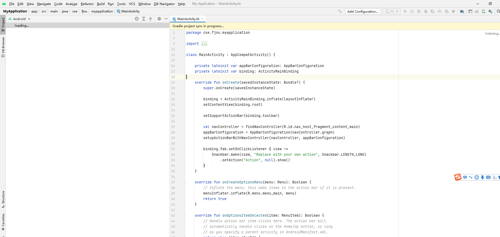
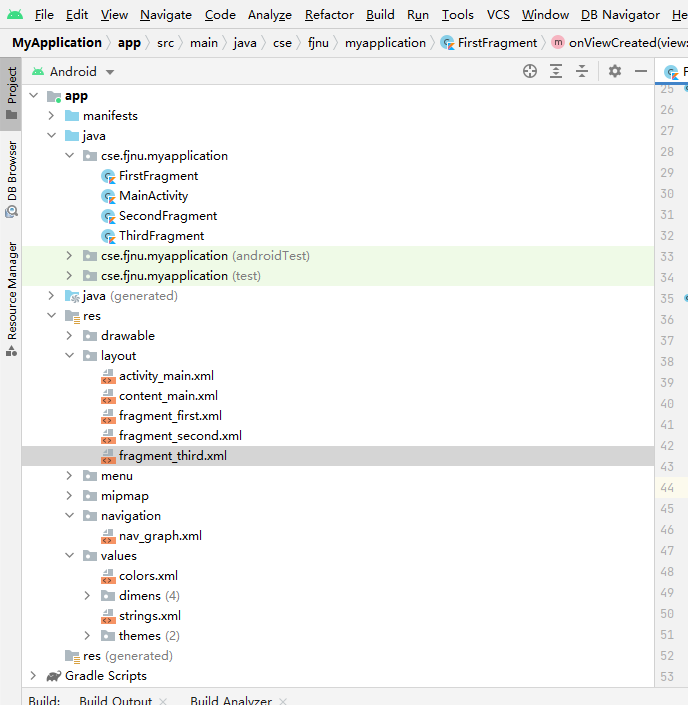
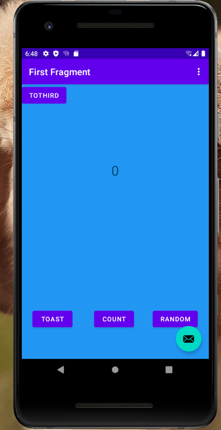
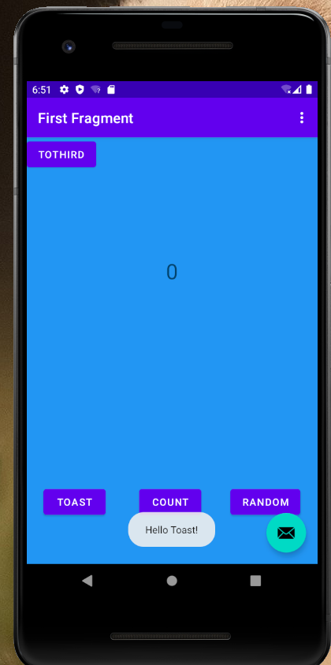
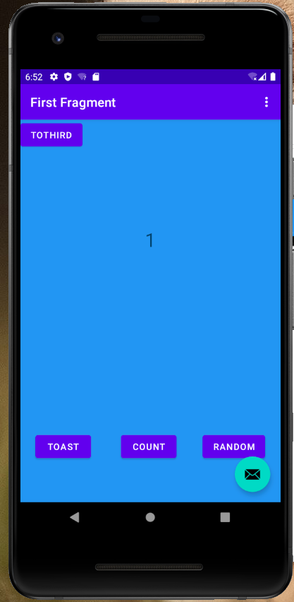
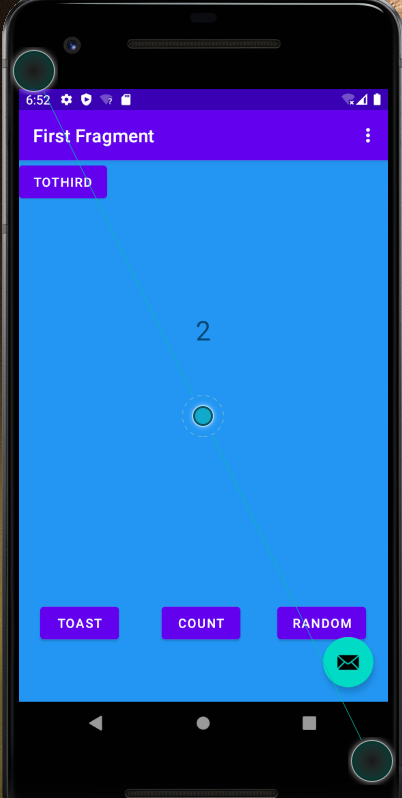
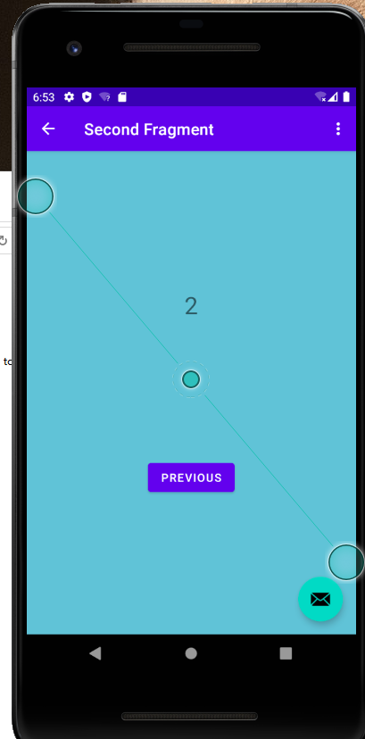
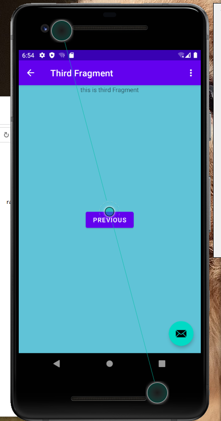
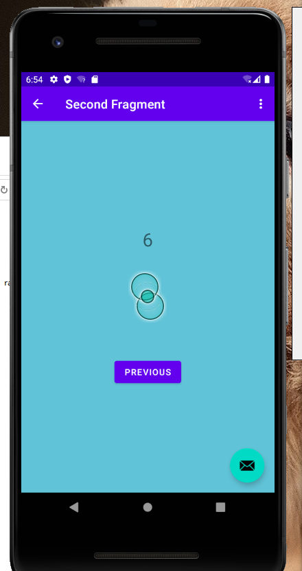

# 实验二（cotlin语言实现fragment页面跳转）
## 第一步
### 新建cotlin程序
 
## 第二步
### 添加第三个页面（ThirdFragment）以及布局文件（fragment_third）
 
## 第三步
### 正常编写代码
#### ！注意在navigation文件下的nav_grap文件内编写好导航配置
#### 如firstFragment文件跳转到secondFragment以及thirdFragment文件需做好以下配置
     <fragment
        android:id="@+id/FirstFragment"
        android:name="cse.fjnu.myapplication.FirstFragment"
        android:label="@string/first_fragment_label"
        tools:layout="@layout/fragment_first">

        <action
            android:id="@+id/action_FirstFragment_to_SecondFragment"
            app:destination="@id/SecondFragment" />
        <action
            android:id="@+id/action_FirstFragment_to_ThirdFragment"
            app:destination="@id/ThirdFragment" />
    </fragment>
### 运行效果展示
#### （1）firstFragment登入页面
 
#### （2）toast按钮点击（每次点击屏幕上出现toast提示）
 
#### （3.1）count按钮点击1（每次点击，屏幕上的数字加一）
 
#### （3.2）count按钮点击2
 
####  (4.1) random按钮点击(每次点击都会跳转到second页面，同时显示一个0-10的随机数)
 
#### （4.2）previous按钮点击（回到firstfragment页面）
 
####  (5)toThird按钮点击（跳转到thirdFragment页面）
 
####  (6)点击previous，跳转到secondFragment页面
 

